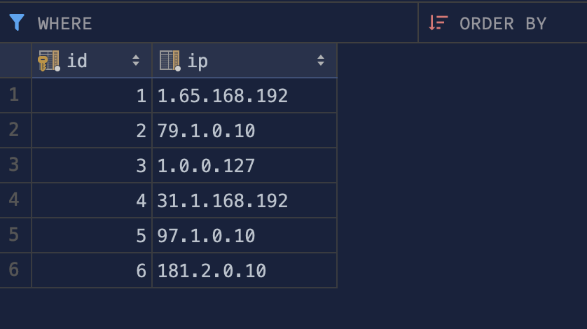

Here are the step-by-step instructions to set up this Flask application:

1. **Clone the repository**: Clone the repository to your local machine using the command `git clone https://github.com/ayobuba/deel-task.git`. 

2. **Install Docker**: If you haven't already, install Docker on your machine. You can download it from the [official Docker website](https://www.docker.com/products/docker-desktop).

3. **Install Docker Compose**: Docker Compose is a tool for defining and running multi-container Docker applications. It's included as part of the Docker Desktop installation on Windows and macOS. For Linux, you can follow the instructions on the [official Docker website](https://docs.docker.com/compose/install/).

4. **Set up environment variables**: Create a `.env` file in the root directory of your project and add the following environment variables: There is a .sample.env you can use to create this file.

```dotenv
POSTGRES_USER=<myuser>
POSTGRES_PASSWORD=<Password>
POSTGRES_DB=<dbs>
POSTGRES_HOST=<host>
```

5. **Build the Docker images**: In the terminal, navigate to the root directory of your project and run the command `docker-compose build`. This command builds the Docker images for your application.

6. **Start the Docker containers**: Run the command `docker-compose up`. This command starts the Docker containers for your application.

7. **Access the application**: Open a web browser and navigate to [http://localhost:5000/reverse](http://localhost:5000/reverse). You should see the reversed IP address of your machine.

8. **Access the application externally**: Open a web browser and navigate to [http://deel-task.plsg.io/reverse](http://deel-task.plsg.io/reverse) or via the loadbalancer [http://k8s-default-reversei-3d81834a14-1282279654.eu-west-1.elb.amazonaws.com/reverse](http://k8s-default-reversei-3d81834a14-1282279654.eu-west-1.elb.amazonaws.com/reverse). You should see the reversed IP address of your machine. 

Please note that the PostgreSQL database used by the application is provisioned with Terraform and hosted on AWS. It is a RDS instance. The Terraform files are located in the `terraform` directory of the repository which includes a `README.md` . 

The application connects to the database using the `DATABASE_URL` environment variable, which is constructed from the `POSTGRES_USER`, `POSTGRES_PASSWORD`, and `POSTGRES_DB` environment variables.
Please note that the application is configured to use a PostgreSQL database.

Each unique reversed IP is stored in the Postgres RDS instance and can be accessed via the `/reversed` endpoint.


## Helm Chart Configuration

The Helm chart for this application is located in the `/deel-task-helm` directory. Helm is used to manage Kubernetes applications. The Helm Chart helps you define, install, and upgrade complex Kubernetes applications.

Here's a brief description of the key files and their purpose:

- `Chart.yaml`: This is the main file that contains the description of our Helm Chart. It includes the version of the chart and the app version.

- `values.yaml`: This file contains the default configuration values for this chart. You can specify the values in this file or provide your own values file.

- `templates/`: This directory contains the template files. These templates generate valid Kubernetes manifest files when combined with values.

- `templates/deployment.yaml`: This file describes the desired state for your application Deployment.

- `templates/service.yaml`: This file is used to set up network access to your application.

- `templates/ingress.yaml`: This file is used to manage external access to the services in a cluster, typically HTTP.

Remember to update the values in `values.yaml` file according to your setup before deploying the Helm chart.

## Github Action Configuration

The pipeline consists of three jobs: lint, build, and deploy.  

- `Lint Job`: Lint Job: This job is responsible for checking the code quality. It sets up Python, installs dependencies, and runs flake8, a Python linting tool, to check for any potential issues in the code.  

- `Build Job`: This job depends on the successful completion of the lint job. It sets up Docker Compose, logs into DockerHub using secrets stored in the GitHub repository, and builds and pushes Docker images. The environment variables for the PostgreSQL database are also set here using secrets.  
- `Deploy Job`: This job depends on the successful completion of the build job. It configures AWS credentials, installs and configures the AWS CLI, updates the kubeconfig for the EKS cluster, installs Helm, and deploys the application to the EKS cluster using Helm. The image repository and database information are set as parameters to the Helm upgrade command.  


#### Please note that the secrets used in this workflow file need to be set in the GitHub repository settings under the Secrets section. These secrets include DockerHub credentials, AWS credentials, AWS region, EKS cluster name, and PostgreSQL database information.


##### Furthermore the pipeline can be configured to be deployed on a successful merge to the main branch. please uncomment `lines 53` in the `.github/workflows/pr-run.yaml` file to enable this feature.